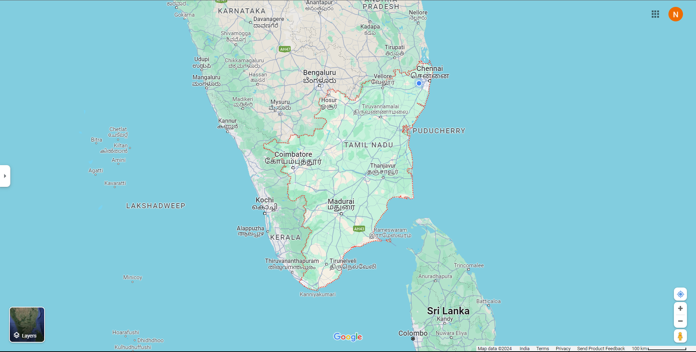
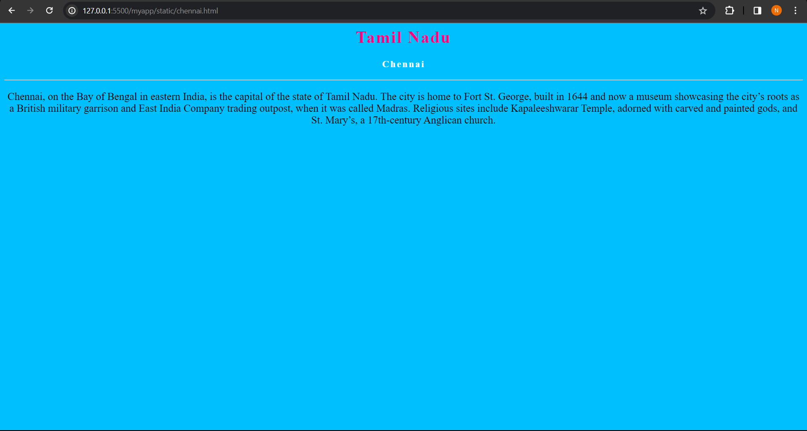
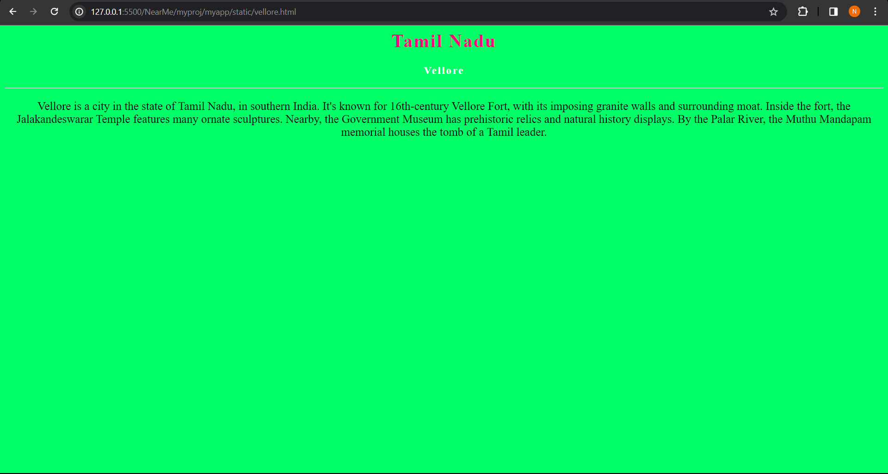
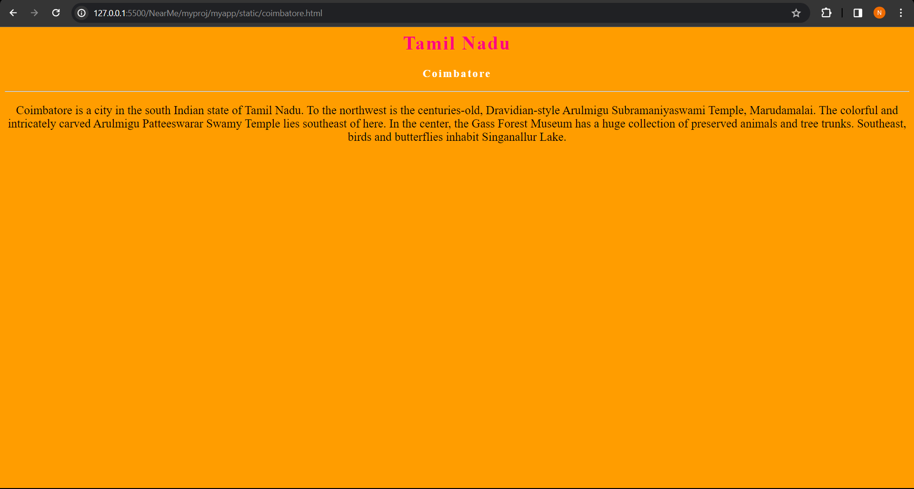
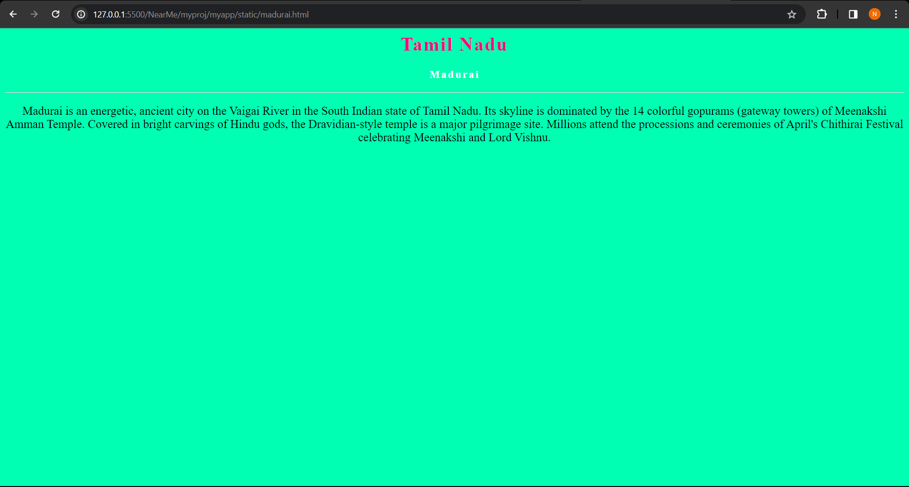
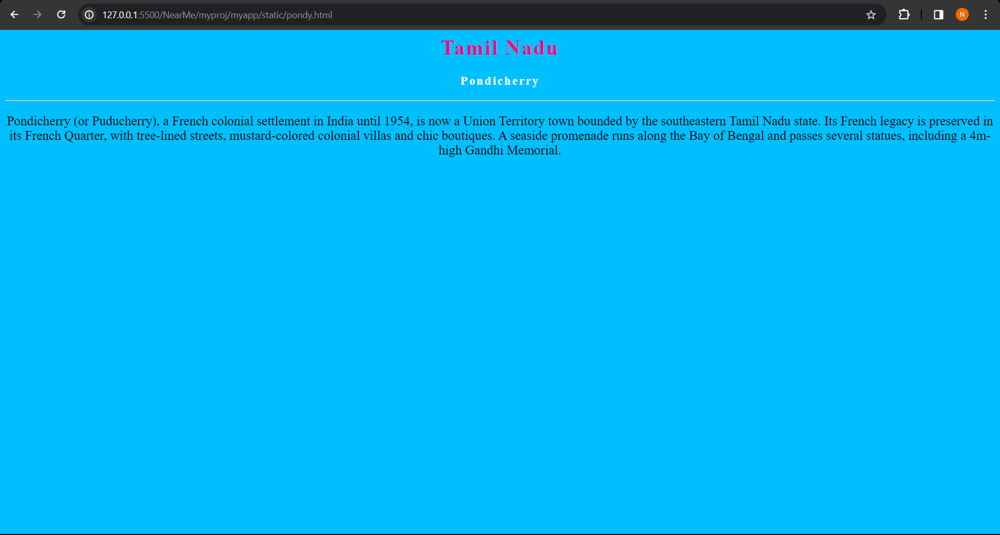

# Ex04 Places Around Me
## Date: 

## AIM
To develop a website to display details about the places around my house.

## DESIGN STEPS

### STEP 1
Create a Django admin interface.

### STEP 2
Download your city map from Google.

### STEP 3
Using ```<map>``` tag name the map.

### STEP 4
Create clickable regions in the image using ```<area>``` tag.

### STEP 5
Write HTML programs for all the regions identified.

### STEP 6
Execute the programs and publish them.

## CODE
map.html
```
<!DOCTYPE html>
<html>
<head>
    <title>Map</title>
</head>
<body>
    
    <map name="workmap">
        <area shape="circle" coords="910,150,30" alt="Chennai" href="chennai.html">
        <area shape="circle" coords="820,150,30" alt="Vellore" href="vellore.html">
        <area shape="circle" coords="630,340,30" alt="Coimbatore" href="coimbatore.html">
        <area shape="circle" coords="720,435,30" alt="Madurai" href="madurai.html">
        <area shape="circle" coords="870,270,30" alt="Pondy" href="pondy.html">
    </map>
</body>
</html>
```
Chennai
```
<html>
    <head>
        <title>Chennai</title>
    </head>
    <body style="background-color: deepskyblue;">
        <center>
            <h1 style="color: rgb(255, 0, 128);letter-spacing: 2px;">Tamil Nadu</h1>
            <h3 style="color: white; letter-spacing: 2px;">Chennai</h3>
            <hr>
            <p style="font-size: 20px;">Chennai, on the Bay of Bengal in eastern India, is the capital of the state of Tamil Nadu. The city is home to Fort St. George, built in 1644 and now a museum showcasing the city’s roots as a British military garrison and East India Company trading outpost, when it was called Madras. Religious sites include Kapaleeshwarar Temple, adorned with carved and painted gods, and St. Mary’s, a 17th-century Anglican church.</p>
        </center>
    </body>
</html>
```
Vellore
```
<html>
    <head>
        <title>Vellore</title>
    </head>
    <body style="background-color: rgb(0, 255, 102);">
        <center>
            <h1 style="color: rgb(255, 0, 128);letter-spacing: 2px;">Tamil Nadu</h1>
            <h3 style="color: white; letter-spacing: 2px;">Vellore</h3>
            <hr>
            <p style="font-size: 20px;">Vellore is a city in the state of Tamil Nadu, in southern India. It's known for 16th-century Vellore Fort, with its imposing granite walls and surrounding moat. Inside the fort, the Jalakandeswarar Temple features many ornate sculptures. Nearby, the Government Museum has prehistoric relics and natural history displays. By the Palar River, the Muthu Mandapam memorial houses the tomb of a Tamil leader.</p>
        </center>
    </body>
</html>
```
Coimbatore
```
<html>
    <head>
        <title>Coimbatore</title>
    </head>
    <body style="background-color: rgb(255, 157, 0);">
        <center>
            <h1 style="color: rgb(255, 0, 128);letter-spacing: 2px;">Tamil Nadu</h1>
            <h3 style="color: white; letter-spacing: 2px;">Coimbatore</h3>
            <hr>
            <p style="font-size: 20px;">Coimbatore is a city in the south Indian state of Tamil Nadu. To the northwest is the centuries-old, Dravidian-style Arulmigu Subramaniyaswami Temple, Marudamalai. The colorful and intricately carved Arulmigu Patteeswarar Swamy Temple lies southeast of here. In the center, the Gass Forest Museum has a huge collection of preserved animals and tree trunks. Southeast, birds and butterflies inhabit Singanallur Lake.</p>
        </center>
    </body>
</html>
```
Madurai
```
<html>
    <head>
        <title>Madurai</title>
    </head>
    <body style="background-color: rgb(0, 255, 179);">
        <center>
            <h1 style="color: rgb(255, 0, 128);letter-spacing: 2px;">Tamil Nadu</h1>
            <h3 style="color: white; letter-spacing: 2px;">Madurai</h3>
            <hr>
            <p style="font-size: 20px;">Madurai is an energetic, ancient city on the Vaigai River in the South Indian state of Tamil Nadu. Its skyline is dominated by the 14 colorful gopurams (gateway towers) of Meenakshi Amman Temple. Covered in bright carvings of Hindu gods, the Dravidian-style temple is a major pilgrimage site. Millions attend the processions and ceremonies of April's Chithirai Festival celebrating Meenakshi and Lord Vishnu.</p>
        </center>
    </body>
</html>
```
Pondicherry
```
<html>
    <head>
        <title>Pondicherry</title>
    </head>
    <body style="background-color: deepskyblue;">
        <center>
            <h1 style="color: rgb(255, 0, 128);letter-spacing: 2px;">Tamil Nadu</h1>
            <h3 style="color: white; letter-spacing: 2px;">Pondicherry</h3>
            <hr>
            <p style="font-size: 20px;">Pondicherry (or Puducherry), a French colonial settlement in India until 1954, is now a Union Territory town bounded by the southeastern Tamil Nadu state. Its French legacy is preserved in its French Quarter, with tree-lined streets, mustard-colored colonial villas and chic boutiques. A seaside promenade runs along the Bay of Bengal and passes several statues, including a 4m-high Gandhi Memorial.</p>
        </center>
    </body>
</html>
```
## OUTPUT






## RESULT
The program for implementing image maps using HTML is executed successfully.
